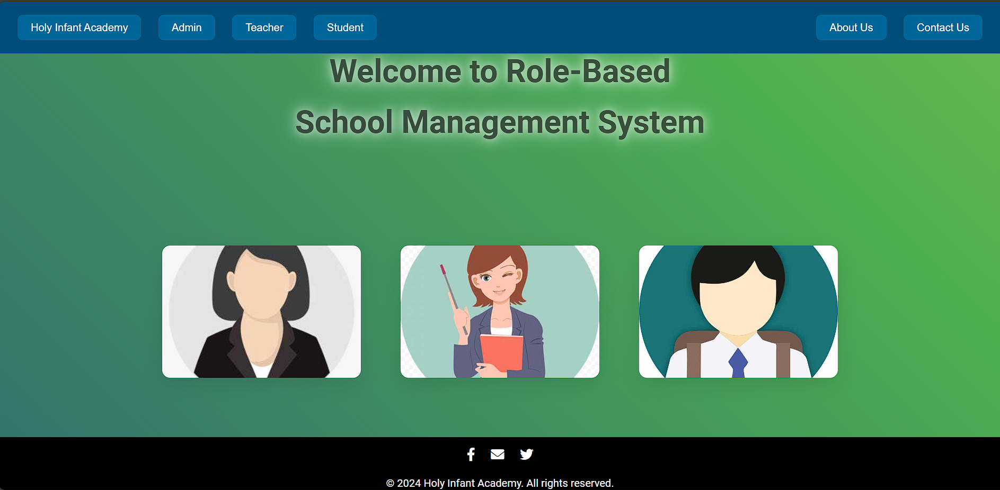
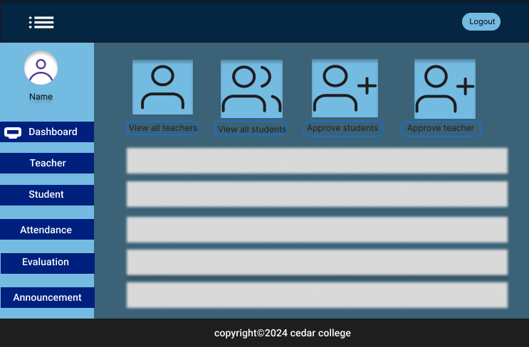
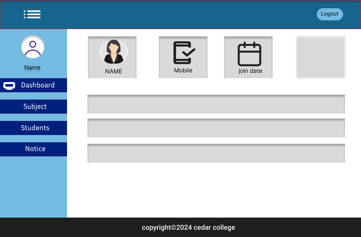
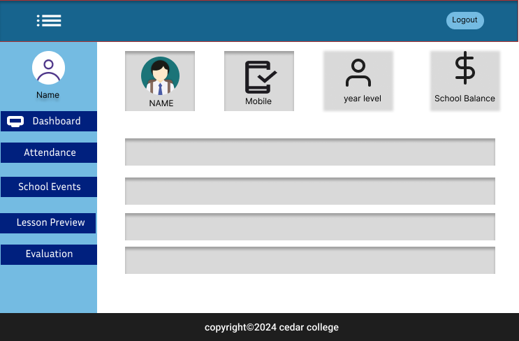

#  Role-Based Management Platform 

## Documentation Disclaimer
Please note that the documentation is still in progress and not yet finalized. We will upload the completed documentation here as soon as possible. 

## Disclaimer
Please note that the system is currently under development. Some features and functionalities may not be fully operational yet. We are working diligently to enhance the platform, and updates will be provided as new functionalities are added. 

## Summary
The  Role-Based  Management Platform is a web-based system designed to streamline academic management processes in educational institutions. It focuses on role-specific access for three user types—teachers, students, and admins—allowing for efficient operations such as student admissions, teacher management, attendance tracking, and communication. 

## User Descriptions

### Teachers
Teachers can log in to the platform after being approved by the admin. They are responsible for marking attendance, viewing past attendance records, and posting notices or task reminders. Teachers have a dashboard to manage their classroom activities.

### Students
Once approved by the admin, students can register and log in to their personal dashboards. They can view their own data, including attendance, but they cannot modify other users’ information or post announcements.

### Admins
Admins have full control over the system. They manage user approvals, update user information, and post school-wide announcements. Admins also oversee system maintenance, ensuring smooth operations and data security.

## System Features by User Role

### Teacher Role
- Teachers can manage their students' attendance and view historical records.
- Teachers have the ability to post notices or reminders for upcoming assignments and deadlines.

### Student Role
- Students can view personal information, including their attendance records, and keep track of their academic performance.
- Students are restricted from modifying others' data.

### Admin Role
- Admins manage user accounts (approve or reject applications), handle data updates, and post school-wide announcements or notices.
- Admins maintain system security by ensuring proper user access controls and system upkeep.

---

## Screenshots 

1. **Teacher Dashboard**  
   
   

2. **Student Dashboard**  
     
   

3. **Admin Dashboard**  
    
   

4. **Home Page**  
   
   

---

## Installation and Setup
1. Clone this repository to your local machine.
   ```bash
   git clone https://github.com/ItsMeMarkAnthony/ROLE-BASED-MANEGMENT-SYSTEM.git

   

This platform is developed using PHP. To run it locally, please follow these steps:

1. **Download and Install XAMPP**  
   You can download XAMPP from the official website: [https://www.apachefriends.org/index.html](https://www.apachefriends.org/index.html). XAMPP includes Apache, MySQL, PHP, and other useful tools.

2. **Add the Project Files to the `htdocs` Directory**  
   Once XAMPP is installed, move the project folder into the `htdocs` directory of your XAMPP installation. The default location for `htdocs` is:
   - Windows: `C:\xampp\htdocs`
   - macOS: `/Applications/XAMPP/htdocs`

3. **Start the XAMPP Control Panel**  
   Open the XAMPP Control Panel and start the Apache server.

4. **Access the Project in Your Browser**  
   Open your web browser and go to: localhost/RoleBasedManagementPlatform 


